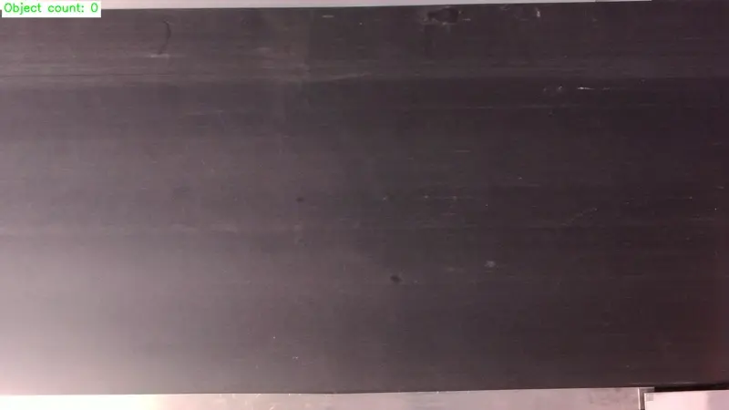

# Conveyor Counting

A sample application that counts objects as they move across a conveyor belt. 

This application is designed to count a single type of object. 

A business-level Groundlight account is necessary to run this application. For more information, reach out to us at support@groundlight.ai.



## App Setup
1. Clone this repo
1. Create a virtual Python environment for dependencies: `python3 -m venv .venv`
1. Activate environment: `source .venv/bin/activate`
1. Install dependencies: `pip install -r requirements.txt`

## Configuration
1. Log in to your Groundlight account at https://login.groundlight.ai and create a "Count" detector. Make note of the detector ID, which starts with "det_". Increasing the "first answer time" on your detector to something like 300 can help give cloud labelers enough time to label your images. You could also disable cloud labeling if you would rather do it yourself. 
1. Edit `config.yaml`. Be sure to include: your detector ID, your camera's serial number, and any other desired configurations for your camera such as resolution.

## Edge Setup
1. Follow the [official deployment instructions](https://github.com/groundlight/edge-endpoint/blob/main/deploy/README.md) for Groundlight Edge Endpoint.
1. In the `edge-endpoint` repo, edit your `configs/edge-config.yaml` to include the following. The `edge_answers_with_escalation` config should already be there. Under detectors, add your detector ID and enter "edge_answers_with_escalation" as the `edge_inference_config`. Apply the configuration according the instructions in the deploy readme. 

```
edge_inference_configs: # These configs define detector-specific behavior and can be applied to detectors below.
  edge_answers_with_escalation: # Always return the edge model's predictions, but still escalate to cloud if unconfident.
    enabled: true
    always_return_edge_prediction: true
    disable_cloud_escalation: false
    min_time_between_escalations: 2.0

detectors: # Each entry here defines the edge configuration for a detector.
  # To configure a detector, add an entry for it below with its detector ID and the name of the edge inference config
  # you want to use. You can use or modify one of the existing edge inference configs listed above, or define your own.
    - detector_id: "det_2vYiO48Fm7bAE0arKpf7nHdGdR4"
      edge_inference_config: "edge_answers_with_escalation"
```
## Camera Setup
Position your camera above the conveyor belt such that the objects will move from left to right. The object tracking algorithm expects this objects to move from left to right.

Check your camera setup by running the app in video only mode: `python app.py --app-mode VIDEO_ONLY`. The app launches a webserver for viewing the camera feed. Check the terminal output for the URL, and then open that URL in your browser. 

## Training
You can submit single images to Groundlight by running the app in SNAPSHOT_INFERENCE mode: `python app.py --app-mode SNAPSHOT_INFERENCE`. Press the enter key in your terminal to take a new picture and perform inference. This is good for training a new detector. This step is optional but encouraged. 

## Run in Production
When you are ready to perform inference on live video, run: `python app.py --app-mode VIDEO_INFERENCE`

To see other options, run: `python app.py --help`