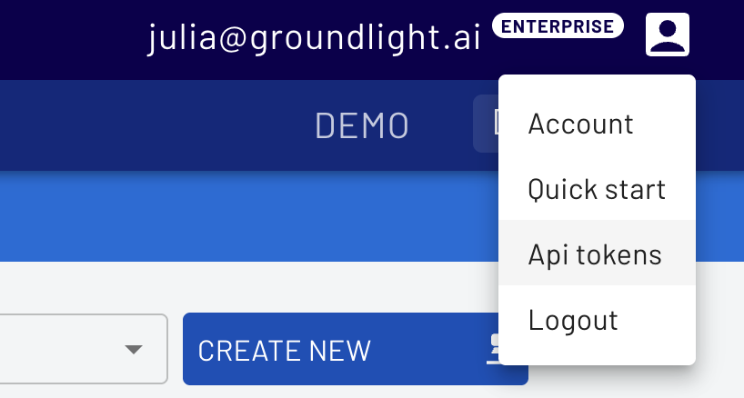

# Real-Time Object Counting on Conveyor Belts with Groundlight's Computer Vision Tools

A sample application that counts objects as they move across a conveyor belt. 

This application is designed to count a single type of object. 

A business-level Groundlight account is necessary to run this application. To access a free trial, reach out to us at support@groundlight.ai.


## Environment Setup
1. Clone this repo
1. Move into the root directory of this repo
1. Create a virtual Python environment for dependencies: `python3 -m venv .venv`
1. Activate environment: `source .venv/bin/activate`
1. Install dependencies: `pip install -r requirements.txt`

## Obtain a Groundlight API Token

Sign up at [dashboard.groundlight.ai](https://dashboard.groundlight.ai/reef/) and navigate to the API tokens page. 





Then export your API token:
```
export GROUNDLIGHT_API_TOKEN='your-api-token'
```


## Configuration
1. Log in to your Groundlight account at https://login.groundlight.ai and create a "Count" detector. Make note of the detector ID, which starts with "det_". 
1. Consider adjusting some settings on your detector. For example, increasing the "first answer time" on your detector to something like 300 seconds gives cloud labelers more time to label your images. You can also disable cloud labeling if you would rather label images yourself. 
1. Edit `config.yaml`. Be sure to include: your detector ID, your camera's serial number, and any other desired configurations for your camera such as resolution.

## Edge Setup
1. Follow the [official deployment instructions](https://github.com/groundlight/edge-endpoint/blob/main/deploy/README.md) for Groundlight Edge Endpoint.
1. In the `edge-endpoint` repo, edit your `configs/edge-config.yaml` to include a section for your detector. See example below. The key setting here is `edge_answers_with_escalation`, which ensures that your application will always get a fast edge answer, but also allow cloud escalation in the background so that your model learns over time.

After updating the yaml file, apply the configuration according the instructions in the deploy readme. 

```
edge_inference_configs: # These configs define detector-specific behavior and can be applied to detectors below.
  edge_answers_with_escalation: # Always return the edge model's predictions, but still escalate to cloud if unconfident.
    enabled: true
    always_return_edge_prediction: true
    disable_cloud_escalation: false
    min_time_between_escalations: 2.0

detectors: # Each entry here defines the edge configuration for a detector.
  # To configure a detector, add an entry for it below with its detector ID and the name of the edge inference config
  # you want to use. You can use or modify one of the existing edge inference configs listed above, or define your own.
    - detector_id: "YOUR_DETECTOR_ID" # Update this with your actual detector ID
      edge_inference_config: "edge_answers_with_escalation"
```
## Camera Setup
Position your camera above the conveyor belt such that the objects will move from left to right. The object tracking algorithm expects this objects to move from left to right.

Check your camera setup by running the app in video only mode: `python app.py --app-mode VIDEO_ONLY`. The app launches a webserver for viewing the camera feed. Check the terminal output for the URL, and then open that URL in your browser. 

## Training
Submit training images to Groundlight by running the app in SNAPSHOT_INFERENCE mode: `python app.py --app-mode SNAPSHOT_INFERENCE`. 

Press the enter key in your terminal to submit images. 

Make sure you submit several diverse training images to Groundlight before running your application in production. Usually several dozen images is enough, but this can vary depending on your application.

## Run in Production
When you are ready to perform inference on live video, run: `python app.py --app-mode VIDEO_INFERENCE`

## Other Options
To see other options, run: `python app.py --help`
